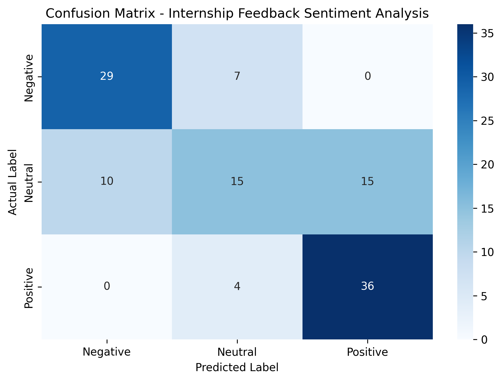

# Internship Feedback Sentiment Analysis

### Task 2 — Machine Learning Internship Project

An NLP-based machine learning project that analyzes internship/employee feedback and classifies it into three sentiment categories: **Negative, Neutral, and Positive**.

The project uses a fine-tuned **DistilBERT** transformer model and an interactive **Gradio** interface for sentiment prediction.

---

## 📌 Project Overview

Organizations collect large amounts of written feedback from interns and employees. Manually analyzing this feedback can be time-consuming.

This project uses Natural Language Processing (NLP) and transformer-based deep learning to automatically classify written feedback according to its sentiment.

### Objectives

- Analyze written internship/employee feedback
- Classify feedback into three sentiment categories
- Apply Natural Language Processing techniques
- Fine-tune a transformer-based model
- Evaluate model performance
- Provide an interactive sentiment prediction interface

---

## 🤖 Model

| Parameter | Value |
|---|---|
| Model | DistilBERT |
| Pre-trained Model | `distilbert-base-uncased` |
| Task | Text Classification |
| Classes | 3 |
| Maximum Sequence Length | 128 |
| Training Epochs | 3 |
| Learning Rate | `2e-5` |

---

## 🏷️ Sentiment Classes

| Class | Description |
|---|---|
| Negative | Negative feedback |
| Neutral | Neutral or mixed feedback |
| Positive | Positive feedback |

---

## 🔄 Machine Learning Pipeline

```text
Internship / Employee Feedback
              ↓
       Data Preparation
              ↓
         Tokenization
              ↓
           DistilBERT
              ↓
        Model Fine-Tuning
              ↓
           Evaluation
              ↓
      Sentiment Prediction
              ↓
        Gradio Interface
---

## 📊 Model Evaluation

The fine-tuned DistilBERT model was evaluated on the validation dataset using Accuracy, Precision, Recall, and F1-score.

### Overall Performance

| Metric | Score |
|---|---:|
| Accuracy | **68.97%** |
| Precision | **67.31%** |
| Recall | **68.97%** |
| F1-score | **66.96%** |
| Evaluation Loss | **0.6580** |

### Classification Report

| Sentiment | Precision | Recall | F1-score | Support |
|---|---:|---:|---:|---:|
| Negative | 74.36% | 80.56% | 77.33% | 36 |
| Neutral | 57.69% | 37.50% | 45.45% | 40 |
| Positive | 70.59% | 90.00% | 79.12% | 40 |
| **Weighted Average** | **67.31%** | **68.97%** | **66.96%** | **116** |

### Confusion Matrix

The confusion matrix shows how the model's predictions compare with the actual sentiment labels.



### Key Findings

- The model achieved an overall accuracy of **68.97%**.
- **Positive** feedback had the strongest recall at **90.00%**.
- **Negative** feedback achieved a recall of **80.56%**.
- **Neutral** feedback was the most challenging class, with a recall of **37.50%**.
- The model frequently confused Neutral feedback with both Negative and Positive feedback.

## 🖥️ Interactive Demo

The project includes a Gradio-based interface that allows users to enter internship or employee feedback and receive a sentiment prediction.

Example:

```text
Input:
"The internship provided an excellent learning experience."

Prediction:
Positive
